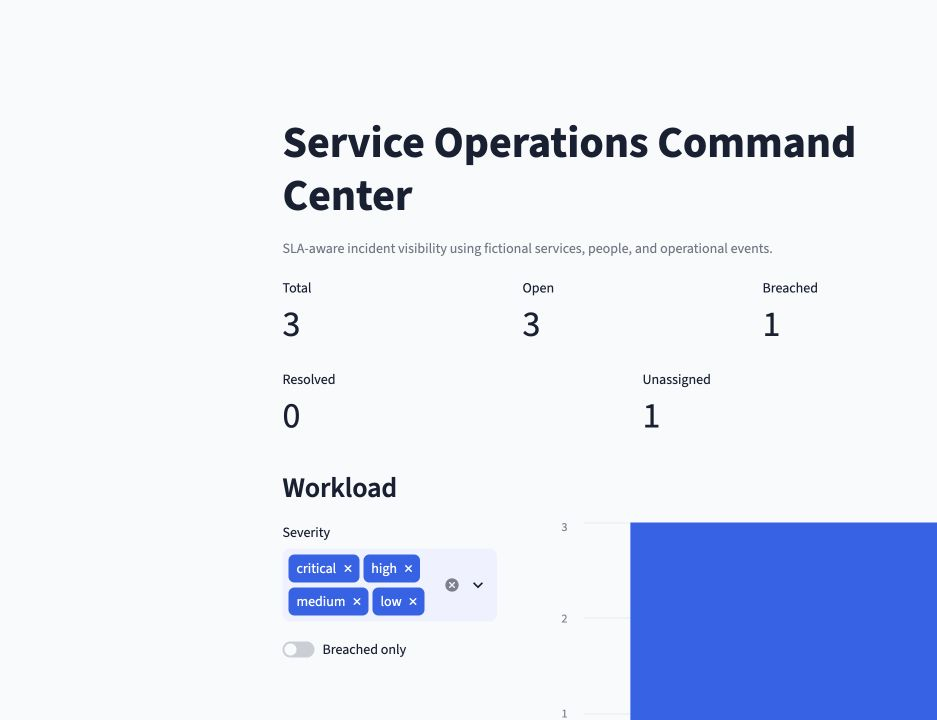
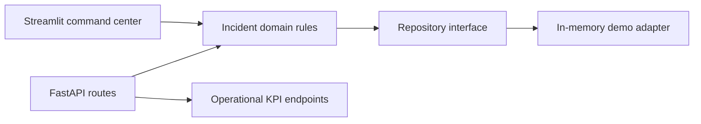

# Service Operations Command Center


**Backend Engineering · SaaS Operations · SLA Management · API Design**

A portfolio-safe service operations API for incident intake, prioritization, ownership, lifecycle control, and SLA visibility.

[API demo](#quick-start) · [Case study](docs/CASE_STUDY.md) · [Architecture](docs/ARCHITECTURE.md) · [Source](https://github.com/alianisreyesr/service-operations-command-center)

> **Data boundary:** The bundled organizations, users, and incidents are fictional. The application is a portfolio prototype, not a production ticketing or emergency-response system.

## Portfolio preview



The dashboard is rendered from the same domain metrics and priority rules exposed by the API.

## Business outcome

Support and technology teams need a consistent operational picture: what is open, what is overdue, who owns it, and which service commitments are at risk. This API turns those questions into explicit domain rules and measurable endpoints.

## Capabilities

- Incident intake with severity-based SLA targets
- Controlled status transitions and owner assignment
- Priority queue ordered by breach state, severity, and due time
- Portfolio-safe actor attribution on mutations
- Reverse-chronological audit events for creation, assignment, and status changes
- Operational metrics for open, breached, resolved, and unassigned work
- Interactive Python/Streamlit command center, OpenAPI documentation, container packaging, and automated tests

## Architecture



The repository boundary is intentionally explicit so a PostgreSQL adapter can replace the demonstration store without moving business rules into HTTP handlers.

## Quick start

```bash
python -m venv .venv
source .venv/bin/activate
python -m pip install -r requirements.txt
uvicorn app.main:app --reload
streamlit run dashboard.py
```

Open the Streamlit command center at `http://127.0.0.1:8501`, the compact FastAPI view at `http://127.0.0.1:8000/`, or the [OpenAPI documentation](http://127.0.0.1:8000/docs). You can also run:

```bash
curl http://127.0.0.1:8000/api/metrics
curl http://127.0.0.1:8000/api/incidents/priority-queue
python -m pytest
```

Docker:

```bash
docker build -t service-operations-command-center .
docker run --rm -p 8000:8000 service-operations-command-center
```

## API surface

| Method | Endpoint | Purpose |
|---|---|---|
| GET | `/health` | Runtime health and portfolio boundary |
| GET/POST | `/api/incidents` | List or create incidents |
| GET | `/api/incidents/priority-queue` | Decision-ready work queue |
| PATCH | `/api/incidents/{id}/status` | Controlled lifecycle transition |
| PATCH | `/api/incidents/{id}/owner` | Attributable owner assignment |
| GET | `/api/metrics` | SLA and workload metrics |
| GET | `/api/audit-events` | Reviewable mutation history |

## Engineering boundary

Authentication is represented by the `X-Actor` header for attributable demo actions; it is not identity verification. Production use would require OIDC, RBAC enforcement, PostgreSQL migrations, background workers, notifications, rate limits, secrets management, observability, tenancy isolation, and recovery controls.

## Target roles

Backend Engineer · Full-Stack Engineer · Software Engineer · Platform Engineer

---

Built by [Alianis Reyes-Reyes](https://www.linkedin.com/in/alianis-reyes-reyes/).
