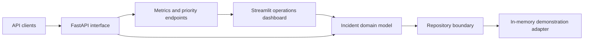
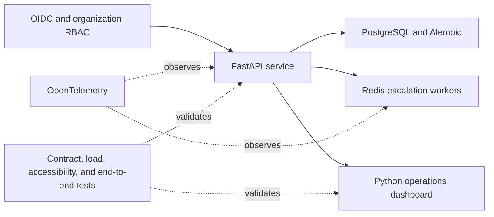

# Architecture

## Layers

1. **HTTP interface:** FastAPI request validation, response models, and status semantics.
2. **Domain:** incident creation, SLA targets, and permitted transitions.
3. **Repository adapter:** in-memory demonstration store, replaceable by PostgreSQL.
4. **Decision endpoints:** priority queue and operational metrics.

## Production roadmap

